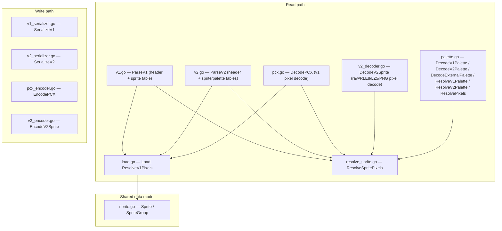

> Generated by /vibe:docs — manual edits will be overwritten; use README for hand-written content.

# Architecture

`sff` is a single Go package (`package sff`, module root) with no sub-packages and no third-party dependencies. Internally it separates into four sub-concerns that mirror the `.sff` file format itself:

## Read path

- **`v1.go` / `v2.go`** — parse a `.sff` file's binary header and sprite (and, for v2, palette) table into `V1SpriteTable`/`V2SpriteTable`. These are low-level, version-specific structs (file offsets, raw table fields) rather than the shared `Sprite`/`SpriteGroup` model, because the shared model can't represent everything a parser needs (offsets) or produces.
- **`pcx.go`** — decodes the RLE-compressed PCX pixel format used by every v1 sprite (`DecodePCX`), plus the real linking-rule resolution (`ResolveV1Pixels`, in `load.go`) needed when a sprite reuses a previous sprite's pixel data.
- **`v2_decoder.go`** — decodes every v2 pixel format: raw, RLE8, LZ5 (dictionary-compressed), and PNG8/24/32 (via `image/png`).
- **`palette.go`** — turns decoded palette bytes into a resolved `Palette`, and resolves indexed pixel data into final `color.RGBA` values (`ResolvePixels`), including forced-transparent-at-index-0 vs. literal-alpha handling depending on the source format. Also decodes standalone external `.act` palette files (`DecodeExternalPalette`) that can override a sprite's own on-disk palette.
- **`load.go`** — `Load` assembles a full file (either version, auto-detected) directly into the shared `[]SpriteGroup` model — the version-agnostic entry point for a consumer that just wants "every sprite in this file."
- **`resolve_sprite.go`** — `ResolveSpritePixels` is a one-call combinator: given a file and a `(group, image)` reference, it parses, decodes pixel data, resolves (or overrides) the palette, and returns final RGBA pixels in one call. This is the function the WASM boundary and most consumers are expected to use.

## Write path

- **`v1_serializer.go` / `v2_serializer.go`** — write a full `.sff` file (either version) from write-only input types (`V1WriteSprite`, `V2WriteSprite`/`V2WritePalette`) that carry real bytes to embed, not decoded pixel data.
- **`pcx_encoder.go` / `v2_encoder.go`** — encode pixel data back into the v1 PCX format or the v2 raw/PNG formats (RLE8/LZ5 encode is not yet implemented — decode-only for those two).

Round trips are semantic (serialize → re-parse → re-decode → compare), not byte-exact: `.sff` is a binary format with no diff-friendliness benefit to preserving an original file's exact layout.

## Shared data model

`sprite.go` defines `Sprite`/`SpriteGroup`, the version-agnostic read-path shape `Load` populates — the vocabulary a consumer (`character`, `stage`, a lifebar app) actually wants to work with, rather than either version's raw on-disk table shape.

## No dependency on `character`

This package was migrated from `character`'s internal `sff/` package unchanged in scope, with every import already stdlib-only — the migration required no code changes beyond the module path itself.
